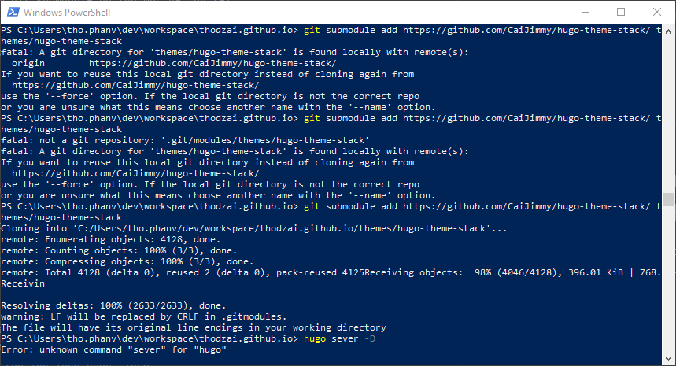

# A git directory for project_name is found locally with remote(s)

Lỗi này xuất hiện khi chúng ta muốn add git submodule nhưng do chưa xóa hết thư mục đã khai báo với git local trước đó. Lỗi sẽ trong như thế này:

## Cách xử lý

remove the folder of the submodule.
remove from .gitmodules
rm -rf .git/modules/myproject
retry the above steps to add it again

* Bước 1: Xóa thư mục submodule
* Bước 2: Xóa khai báo trong .gitmodules
* Bước 3: Tìm và xóa thư mục submodule trong `.git/modules/` hoặc chạy lệnh `rm -rf .git/modules/submodule_name`
* Bước 4: Chạy lại lệnh add git submodule
