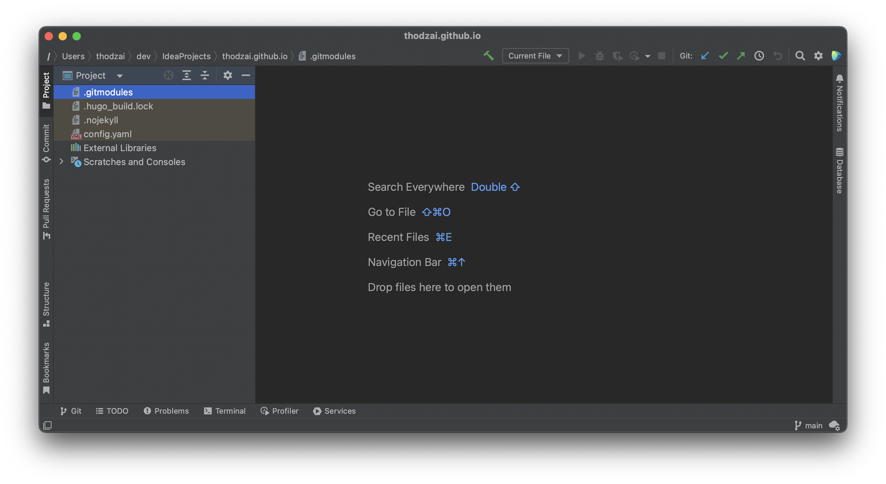
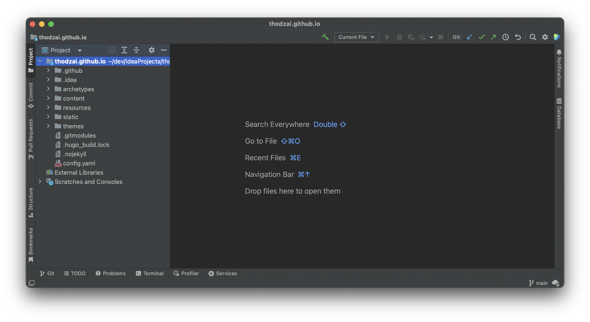

+++
categories = [
"Coding"
]
tags = [
"IntelliJ"
]
title = "IntelliJ project not show hierarchy"
weight = 2
+++

# IntelliJ project not show hierarchy

In some cases, that might lead IntelliJ to load project but won't show the hierarchy as normally.

## How to fix

* Step 1: Close all opened projects, and terminate completely IntelliJ application
* Step 2: Go to project folder
* Step 3: Remove idea / .idea folder
* Step 4: Re-open project with IntelliJ

Now this is the result

