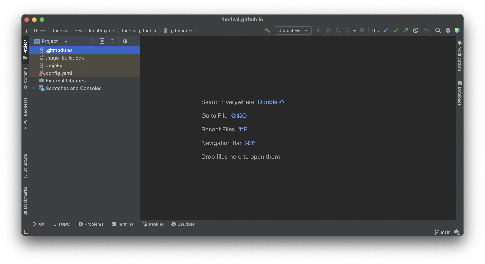
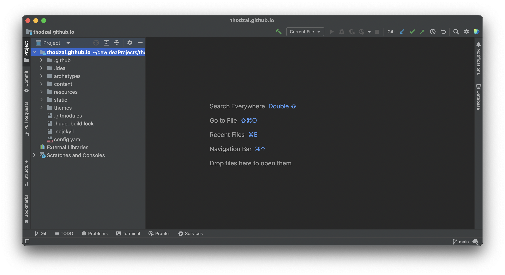

+++
categories = [
"Coding"
]
tags = [
"IntelliJ"
]
title = "IntelliJ project không hiển thị cây thư mục"
weight = 2
+++

# IntelliJ project không hiển thị cây thư mục

Trong một số trường hợp nào đó có thể IntelliJ sẽ load project lên không hiển thị được cây thư mục như hình này

## Cách xử lý

* Bước 1: Đóng tất cả project và tắt hoàn toàn ứng dụng IntelliJ
* Bước 2: Vào thư mục của project đang lỗi hiển thị
* Bước 3: Tìm và xóa thư mục idea hoặc .idea
* Bước 4: Mở ứng dụng IntelliJ và mở lại project

Ta sẽ được project load lại như này

